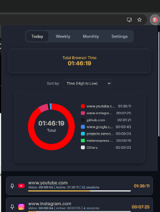
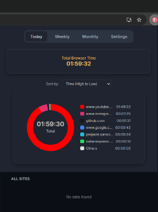

# Clicksand ⏳

**A Smart, Gamified Time Tracker for the Modern Web**

Clicksand goes beyond simple time tracking. It intelligently distinguishes between **Active Browsing** (scrolling, clicking) and **Video Consumption** (watching YouTube, Netflix, etc.) to give you the most accurate picture of your digital life. 

Features a beautiful, premium dark-mode UI with gamified achievements to keep you productive.



## ✨ Key Features

*   **🎥 Smart Video Tracking**: Automatically detects when you are watching a video (YouTube, Netflix, etc.) vs. just browsing.
    *   **Heartbeat System**: Ensures accurate tracking even during long movies without the tracker "glitching" or timing out.
    *   **Background Tracking**: Tracks video time even if you switch tabs (great for music/podcasts).
*   **🎯 Gamified Achievements**: Set an interval (e.g., 30 mins) and get notified with cheerful messages when you hit focus milestones on specific sites.
    *   *Note: Achievements are strictly for Active Usage.*
*   **📌 Pinned Sites**: Pin your favorite or most critical sites to the top for a quick dashboard view.
*   **📊 Visualization**: Beautiful interactive charts (Daily Breakdown & Weekly/Monthly History).
*   **🎨 Custom Themes**: Choose from premium themes like **Catppuccin**, **Dracula**, **Tokyo Night**, and more.
*   **🔒 Privacy First**: All data is stored LOCALLY on your device. Nothing leaves your browser.
*   **⚠️ Data Reset**: Includes a "Danger Zone" to securely wipe all progress if you want a fresh start.

## 🚀 Installation

1.  **Clone the Repository**:
    ```bash
    git clone https://github.com/adityavvyas/Clicksand.git
    ```
2.  **Load into Chrome**:
    *   Open Chrome and go to `chrome://extensions`.
    *   Enable **Developer Mode** (top right).
    *   Click **Load unpacked**.
    *   Select the `Clicksand` folder.

## 💡 Usage Guide

### The Dashboard
*   **Today's Stats**: See exactly how much time you spent on `Active` browsing vs `Video` watching.
*   **Pinned Items**: Click the Pin icon 📌 next to any site to keep it at the top. Pinned sites show focused stats.



### Settings & Customization
*   **Achievements**: Go to Settings ⚙️ -> Achievement Sites. Add domains like `github.com` or `coursera.org`. Set the interval (e.g., 45 mins).
*   **Themes**: Switch between "Comfy (Rose Pine)", "Lucid (Glass)", and other themes to match your vibe.
*   **Reset Data**: Need a restart? Use the Reset button in Settings (with safety confirmation) to clear history.

## 🛠️ Tech Stack
*   **Manifest V3**: Future-proof Chrome Extension architecture.
*   **Vanilla JS**: Lightweight and fast.
*   **Chart.js**: For beautiful data visualization.

---
